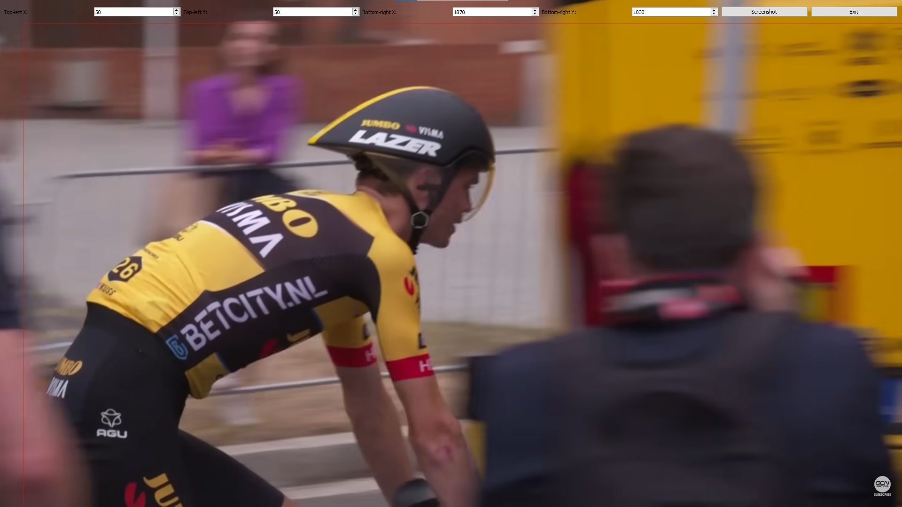

# YouTube Data Collector

A simple PyQt tool to take screenshots from YouTube videos. With its transparent overlay, you can specify a region on the screen and capture data. Useful for dataset creation!

## Features

- **Region Selection**: Define the area you want to capture.
- **Global Hotkey**: Take a screenshot anywhere with a simple hotkey.
- **Auto-save**: Images are automatically saved to a specific directory.

## Prerequisites

1. Python3
2. PyQt5
3. `keyboard`

You can install the required packages via `pip`:

## Usage

1. Run the tool.
2. Use the spin boxes at the top to specify the top-left and bottom-right coordinates of the screenshot region.
3. Press the "Screenshot" button to capture the image or use the hotkey `s`.
4. Captured screenshots will be saved in the `dataset` directory.
5. Click "Exit" or close the window to quit the application.
